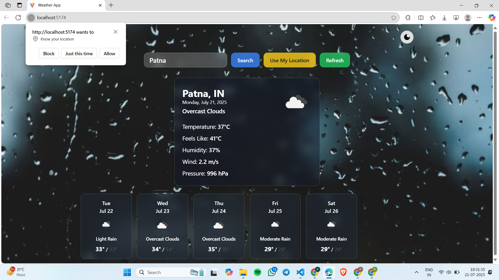

# ⛅️ MERN Stack Weather App

A modern, responsive **Weather Forecast Web Application** built using the **MERN Stack** (MongoDB, Express.js, React.js, Node.js). This app allows users to:

* Search weather conditions by **city name**
* Get **current weather** and **5-day forecast**
* Use **geolocation** to fetch local weather
* Toggle between **light and dark modes**
* Enjoy **mobile responsiveness** for any device

---

## 🌐 Live Weather Preview

### 🔍 City Search & Forecast



### 🌫️ Dark Mode View


### ☀️ Light Mode View


### 📱 Mobile Responsive UI


---

## 🚀 Features

* Real-time weather data using **OpenWeatherMap API**
* Dynamic **background and theme switching**
* **City autocomplete** functionality
* Display of:

  * Temperature & feels like
  * Wind speed
  * Humidity
  * Pressure
  * Weather icons and forecast details
* **Responsive design** for all devices

---

## 🧱 Tech Stack

* **Frontend**: React.js, TailwindCSS, Context API
* **Backend**: Node.js, Express.js
* **Database**: MongoDB (for user/location preferences, if extended)
* **API**: OpenWeatherMap

---

## 🔧 Getting Started

```bash
# Clone the repo
https://github.com/your-username/weather-app.git

# Navigate to project folder
cd weather-app

# Install dependencies for client and server
npm install
cd client && npm install

# Start the server
npm run server

# Start the client
cd client
npm start
```

> Make sure you add your `OpenWeatherMap API key` in the `.env` file.

---

## 📄 Environment Variables

Create a `.env` file in your root and add:

```env
REACT_APP_WEATHER_API_KEY=your_api_key_here
```

---

## 🚀 Future Enhancements

* Save user preferences and favorite locations
* Hourly weather forecast
* Animated weather icons
* Integration with weather news APIs

---

## 📚 License

This project is licensed under the MIT License - feel free to use and contribute!

---

## ✨ Show Your Support

Give a star ⭐ if you like this project and want to see more!

---


## 👤 Author

**Prince Singh**
GitHub: [@PrinceSingh1005](https://github.com/PrinceSingh1005)
